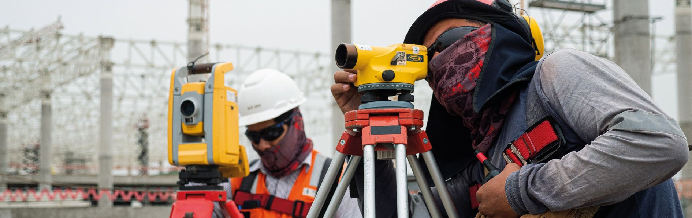
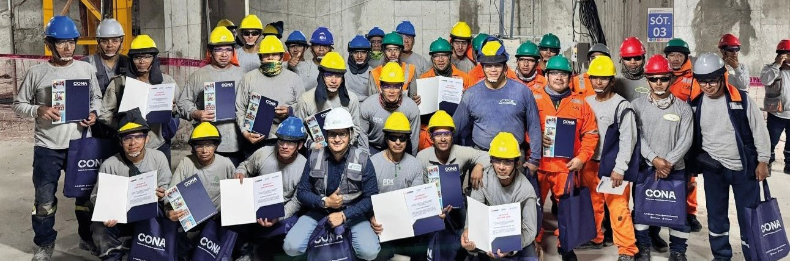

# PARTE 4: INNOVACIÓN, INVESTIGACIÓN Y DESARROLLO DE COMPETENCIAS

## INNOVACIÓN A TRAVÉS DE LA HISTORIA

En el siglo XIX, los hilanderos ingleses, conocidos como luditas, se vieron sorprendidos por la aparición de una máquina capaz de realizar su trabajo con mayor rapidez. Temiendo por sus empleos, se sintieron amenazados por esta innovación y pasaron cinco años resistiéndose al avance tecnológico. Sin embargo, su lucha, aunque comprensible desde su perspectiva, resultó infructuosa. La gran lección que deja la modernidad es clara: oponerse a la innovación suele ser un esfuerzo destinado al fracaso.

En la actualidad, el mundo vive una era en la que los celulares, el internet, los algoritmos y la inteligencia artificial son omnipresentes, por lo que la pregunta de si se puede subsistir sin ellos parece absurda pues la innovación sigue transformando todos los aspectos de la vida y, tal como explica Jeremy Rifkin, en su libro "El nuevo acuerdo verde", la tecnología se sostiene sobre tres pilares: un medio de comunicación, un medio de transporte y una fuente de energía.

A lo largo de la historia, los saltos tecnológicos han ido acortando drásticamente sus ciclos de aparición. Hace apenas dos décadas, muchos de los avances que hoy forman parte de la vida cotidiana eran impensables. Lo que en su momento fue considerado una innovación, ahora ocupa un lugar en los museos. Así sucedió con empresas emblemáticas como Kodak y Blockbuster, que en su época fueron líderes globales en sus respectivos rubros, pero terminaron siendo víctimas de su falta de adaptación. Kodak no adoptó a tiempo la fotografía digital, mientras que Blockbuster subestimó la amenaza que representaba Netflix y su modelo de negocio basado en la proyección de videos mediante una plataforma de streaming.

En el contexto de esa evolución, la industria de la construcción enfrenta también desafíos relacionados con la innovación y la sostenibilidad. Se considera que la actividad constructora es una de las más contaminantes, pero este argumento es incompleto, pues sin ella no habría plataformas para el desarrollo de otras industrias se podría generar niveles significativos de bienestar para los ciudadanos proporcionándoles vivienda, hospitales, escuelas e infraestructura variada, que además resultan esenciales para promover oportunidades.

{width="6.276224846894138in" height="2.1770833333333335in"}

**La urbanización impulsa el desarrollo, pero nuestras ciudades enfrentan invasiones, déficit de infraestructura y un estado incapaz de proveer bienes básicos. Para superar estos retos, es esencial la colaboración entre el sector público y privado, además de adoptar la innovación como motor clave para transformar y mejorar nuestras ciudades.**

La innovación en la construcción se viene produciendo en nuestro país, pero no con la celeridad que se necesita. En Colombia, por ejemplo, se construyen conjuntos de vivienda multifamiliar en barrios marginales, reduciendo la vulnerabilidad frente a fenómenos naturales, la inseguridad ciudadana y la precariedad de las viviendas. Este tipo de proyectos están lejos todavía de desarrollarse en el Perú. Sin embargo, proyectos como Los Parques de El Agustino, en Lima, o de viviendas Techo Propio en la Comunidad Campesina de Yanamayo (Cusco) son dos ejemplos de éxito en materia de vivienda social. El primero demuestra el potencial de la recuperación urbana en entornos densamente poblados y degradados, mientras que el segundo confirma que es viable levantar unidades habitacionales asequibles y eficientes incluso en zonas altoandinas, a más de 3,900 m.s.n.m.,
cuando la iniciativa privada y la comunidad se articulan. Ambos casos ponen en relieve que la innovación puede traducirse en soluciones reales para los sectores más vulnerables. Replicar y ampliar este tipo de proyectos es esencial para responder a la creciente demanda habitacional del país.

La tecnología sigue avanzando rápidamente en la construcción. En Canadá, ya se levantan edificios de gran altura con estructuras completas en madera, un recurso renovable y menos contaminante. Incluso en China, Estados Unidos y Europa se ha comenzado a edificar utilizando impresoras 3D de gran tamaño y, aunque esta tecnología está en una fase embrionaria, tiene un enorme potencial para el futuro.

El proceso de automatización también está impactando fuertemente en las actividades industriales y se estima que casi la mitad de los trabajos que actualmente están a cargo seres humanos serán desarrollados por máquinas en el futuro cercano. En el Perú, la implementación de tecnologías como el sistema BIM (Building Information Modeling) han dado sus primeros pasos, empleándose exitosamente en algunos proyectos como el de la infraestructura deportiva para los Juegos Panamericanos Lima 2019, que se ejecutó en tiempo récord y en condiciones óptimas.

A pesar de ciertos avances, persisten procesos constructivos obsoletos que continúan retrasando el desarrollo de infraestructura en el país. En contraste, naciones como China lideran el empleo de tecnologías de punta, como los trenes de levitación magnética que alcanzan velocidades de hasta 405 km/h. Mientras tanto, en el Perú, infraestructura indispensable como la Línea 2 del Metro de Lima acumula varios años de retraso.

La innovación en organización del trabajo, en sistemas constructivos y en gestión de proyectos es aún insuficiente en nuestro país, impidiendo la mejora continua de los procesos de construcción; afectando calidad, durabilidad y costo de las infraestructuras y reduciendo sensiblemente las posibilidades de incrementar la competitividad de empresas y trabajadores. La aplicación de diseños y sistemas constructivos industriales y estandarizados se encuentra muy rezagada respecto a la alcanzada en otros países latinoamericanos. Esto plantea un gran desafío: preparar a los trabajadores y a las empresas para su adaptación a los cambios inminentes en la forma en que se construirá en el futuro.

## CAPACITACIÓN TÉCNICA

En ese contexto, el CONA, creado en el año 1976 como resultado de la negociación colectiva entre la Federación y CAPECO, tuvo como propósito inicial administrar un fondo orientado a atender las principales necesidades del trabajador constructor, especialmente en materia de vivienda, recreación y asistencia social. Es a partir de 1995, con la ampliación de sus funciones mediante dispositivos legales, que el CONA asumió el desafío de ofrecer capacitación técnica a mayor escala.

A lo largo del tiempo, el CONA ha evolucionado hacia un enfoque más integral, posicionándose como un órgano de gestión que impulsa estrategias formativas alineadas con las crecientes exigencias técnicas del sector. Su labor ha estado marcada por la promoción de la inclusión, la descentralización de los servicios y la innovación educativa, consolidando su rol como un actor clave en la construcción de un capital humano calificado y competitivo.

Este enfoque ha permitido ampliar la cobertura, elevar la calidad de la capacitación y mejorar las oportunidades laborales de miles de trabajadores, reafirmando que la formación técnica es una herramienta clave para transformar vidas, fortalecer comunidades y contribuir al desarrollo sostenible del país. El CONA ha evolucionado desde un modelo básico presencial hasta una oferta educativa diversa que combina modalidades virtuales y presenciales, adaptándose a las necesidades del mercado y del trabajador.

Para garantizar la transparencia en la gestión de los aportes de los trabajadores, el Ministerio de Vivienda, Construcción y Saneamiento y, el Ministerio de Trabajo y Promoción del Empleo, participan como veedores dentro de la estructura del CONA, asegurando que los fondos sean destinados adecuadamente a los programas de bienestar y capacitación.

La labor del CONA ha sido fundamental para garantizar que los trabajadores puedan acceder a mejores oportunidades laborales en un sector marcado por la alta rotación y la informalidad. La falta de acceso a capacitación continua, sin acceso a formación educativa técnica, genera que los trabajadores pierdan competitividad en el mercado formal, aumentando su dependencia de empleos informales.

En sus primeros años, las capacitaciones se realizaban en alianza con SENCICO. Sin embargo, la firma del convenio con el Instituto CAPECO en 2019 marcó un punto de inflexión, estructurando un sistema de cursos continuos orientados a fortalecer las competencias técnicas y mejorar la empleabilidad de los participantes. A lo largo del tiempo, el CONA ha diversificado su oferta formativa, actualmente compuesta por 21 cursos en áreas clave como lectura de planos, instalaciones eléctricas, albañilería, logística y gestión de la seguridad en la construcción.

Su programa de capacitación ha experimentado un crecimiento sostenido, instruyendo a más de 10,238 trabajadores en 2024, superando en 122% la meta anual proyectada. Ese crecimiento responde a la implementación de estrategias de difusión como la campaña "En

Búsqueda de los 45", orientada a captar al menos 45 participantes por curso, y la mejora en los procesos de inscripción y matrícula, ahora optimizados mediante plataformas digitales que permiten una inscripción eficiente y amigable.

Otro importante objetivo alcanzado es la atención descentralizada. Se ha logrado que el 69% de las capacitaciones se realicen en regiones, cubriendo el 100% del territorio nacional en modalidad virtual y el 52% en modalidad presencial, con enfoque en las zonas rurales y de difícil acceso. Este esfuerzo ha permitido llegar a regiones como Piura, Moquegua, Arequipa, Apurímac y Puno, donde se han dictado cursos presenciales adaptados a las necesidades locales. Este enfoque integral responde no solo a la demanda del mercado, sino también a la necesidad de actualizar y certificar competencias, especialmente para la obtención de la tarjeta el Registro Nacional de Trabajadores de Construcción Civil (RETCC), indispensable para trabajar en empresas formales.

De otro lado, la asistencia y culminación efectiva de los cursos de capacitación son aspectos fundamentales para asegurar el impacto de la formación en los trabajadores de la construcción civil. En ese marco, y con el fin de enfrentar el desafío del Desaprobado por Inasistencia (DPI), que limita la retención y el éxito académico, se ha puesto en marcha un plan integral de seguimiento educativo.

Este plan contempla acciones como el envío de recordatorios personalizados, la asesoría técnica continua, una mayor flexibilidad en la justificación de inasistencias y el monitoreo en tiempo real del progreso de los participantes. Gracias a estas medidas, el índice de DPI se redujo del 38% al 25% entre junio y diciembre de 2024.

Este tipo de seguimiento no solo mejora la asistencia, sino que también asegura una mayor tasa de finalización de los cursos, lo que optimiza la inversión realizada y eleva la calidad de la experiencia educativa. La personalización del acompañamiento ha sido clave para fortalecer la satisfacción de los participantes y consolidar una percepción positiva del programa formativo.

Para hacer más valiosa la participación de los afiliados al CONA, la entidad cuenta con un convenio de colaboración con Swisscontact y Fundación Hilti, a través del proyecto VIPRO (Vivienda Progresiva). Esta es una iniciativa orientada a promover la construcción sostenible y eficiente, permitirá que trabajadores del sector puedan capacitarse técnicamente a

{width="6.318578302712161in" height="2.2122911198600175in"}

**El CONA espera cerrar el 2025 capacitando a 12 mil trabajadores, priorizando a grupos vulnerables y personas con discapacidad. Amplió su oferta formativa a 25 cursos, incorporando sostenibilidad y nuevas tecnologías, además de fortalecer la formación de instructores en regiones para garantizar una descentralización con altos estándares.**

la vez que colaboran con la rehabilitación y reforzamiento de las viviendas seleccionadas para este programa, que ofrece especializar en metodologías de construcción progresiva, adaptadas a las necesidades del sector y de las familias que buscan soluciones habitacionales accesibles y seguras.

***Retos y oportunidades*.** Los importantes avances alcanzados por el CONA en materia de capacitación merecen ser exponenciados, no solo para consolidar lo logrado, sino también para responder a los nuevos desafíos que enfrenta el sector construcción en el Perú. A pesar del progreso, persisten retos significativos que demandan una estrategia formativa cada vez más sólida, inclusiva y descentralizada.

Uno de los principales desafíos es ampliar la cobertura para alcanzar al menos al 10% de los 120 mil trabajadores afiliados a nivel nacional. A ello se suma la necesidad de diversificar la oferta educativa, incorporando cursos orientados a la innovación tecnológica y al uso de nuevos materiales de construcción.

Reducir el índice de Desaprobado por Inasistencia (DPI) también sigue siendo una prioridad, para lo cual se requiere aplicar metodologías pedagógicas más dinámicas y ofrecer un seguimiento académico personalizado. Otro reto clave es lograr la validación oficial de los cursos como requisito directo para la renovación del carné RETCC, lo que implica gestionar

la modificación de la Resolución Ministerial N.º 265-2018-TR. Además, se busca incorporar con mayor fuerza la perspectiva de género e inclusión, incrementando la participación femenina, que en 2024 alcanzó apenas el 6%.

Con la mirada puesta en 2025, el CONA se fijó objetivos ambiciosos y estratégicos: capacitar a 12 mil trabajadores, con un enfoque especial en personas con discapacidad y grupos vulnerables. Además, ampliar el catálogo formativo de 21 a 25 cursos, incluyendo temáticas como construcción sostenible y tecnologías emergentes; y fortalecer la formación de instructores en regiones, garantizando una descentralización efectiva sin comprometer los estándares de calidad. **(Figura 4.1 y 4.2)**

Asimismo, se apunta a optimizar los sistemas digitales para una gestión académica más eficiente, lo que incluye la creación de una base de datos nacional de trabajadores capacitados. Por último, continuará impulsando iniciativas sociales como el programa VIPRO, orientado a salvar vidas mediante la mejora de viviendas vulnerables, reafirmando el compromiso del CONA con el bienestar y la seguridad de los trabajadores de construcción civil.

En conclusión, la trayectoria de la Oficina de Capacitación del CONA demuestra un compromiso sostenido con el desarrollo profesional y humano de los trabajadores de la construcción. A través de alianzas estratégicas, metodologías innovadoras y una clara visión descentralizada, se ha logrado no solo ampliar la cobertura y mejorar la calidad de la formación, sino también transformar vidas y contribuir al desarrollo de comunidades más resilientes y capacitadas.

{width="6.315488845144357in" height="1.993332239720035in"}

**La sistematización de datos sobre trabajadores permite analizar tendencias, riesgos y oportunidades en la construcción, mejorando políticas de empleo, formación, seguridad laboral y previsión social. Asimismo, la información sobre obras facilita la optimización de programas de inversión en vivienda, infraestructura y servicios públicos, promoviendo un desarrollo urbano más eficiente y sostenible.**

Con la consigna "Donde nadie llega, CONA va capacitando", la institución reafirma su propósito de llegar a cada rincón del país, brindando oportunidades de aprendizaje que impactan positivamente en la empleabilidad, la seguridad laboral y la calidad de vida de miles de peruanos.

## FONDO DE CAPACITACIÓN

Para seguir impulsando la capacitación técnica de los trabajadores y responder a las nuevas exigencias del sector, el CONA y CAPECO consensuaron la creación del Fondo de Capacitación, una alianza estratégica que reafirma el compromiso bipartito con el desarrollo del capital humano en construcción civil. Este nuevo fondo representa un paso importante en la consolidación de esfuerzos sostenidos para mejorar la cualificación laboral y fomentar una formación con mayor alcance e impacto.

Formalizado en la Negociación Colectiva por Rama de Actividad correspondiente al periodo 2023--2024, el Fondo de Capacitación fue constituido como una asociación de naturaleza especial, con personalidad jurídica de derecho privado, y tiene como propósito financiar la capacitación técnica de los trabajadores del sector. En la Negociación Colectiva 2024-- 2025, el beneficio fue ampliado para incluir también a los hijos, quienes pueden acceder a cualquier tipo de formación ofrecida. Además, el fondo contempla la posibilidad de otorgar becas, siempre que se acredite la necesidad, conforme a un estatuto y reglamento aprobados por la FTCCP y CAPECO, cumpliendo con las disposiciones legales vigentes.

Este fondo marca un hito en la relación entre la Federación y CAPECO. Por un lado, los empleadores asumen un aporte económico obligatorio de S/ 0.20 por día laborado, destinado exclusivamente a la capacitación, lo que evidencia su compromiso con el fortalecimiento del sector. Por otro lado, las políticas y programas de formación se gestionan de manera autónoma a través de una entidad independiente, conformada únicamente por personas jurídicas representantes de ambas organizaciones. Esta estructura garantiza transparencia, corresponsabilidad y una visión compartida orientada a elevar los estándares de profesionalización en la construcción civil.

El Instituto CAPECO, licenciado por el Ministerio de Educación (Minedu), opera como aliado académico del Fondo. Su modelo incluye dos cuerpos formativos principales. El primero incluye carreras con una duración de 3 años y están dirigidas a quienes quieren formarse como profesionales técnicos en construcción civil; y, el segundo, son los cursos de formación continua diseñados para trabajadores en obra que buscan mejorar sus habilidades técnicas sin necesidad de ingresar a un programa de largo plazo. Esta metodología incluye programas cortos que abarcan desde buenas prácticas en albañilería y lectura de planos hasta el manejo de drones y metodologías avanzadas como BIM (Building Information Modeling).

Dentro de su propuesta educativa, el Instituto CAPECO pone a disposición un portafolio de 53 cursos organizados en distintas áreas como topografía, lectura de planos, instalaciones eléctricas y sanitarias, normativa técnica y gestión de costos. La duración de estos programas varía entre 8 y 48 horas, aunque los más solicitados son los de 16 y 32 horas. Una ventaja importante es que todos los cursos que superan las 16 horas cuentan con certificación oficial del Ministerio de Educación, otorgada a nombre de la Nación, lo que les brinda un mayor respaldo y reconocimiento para los trabajadores que buscan mejorar su perfil profesional.

En el marco del Fondo de Capacitación, la participación de las empresas constructoras con un volumen determinado de personal está directamente ligada a este esquema y debe desarrollarse en coordinación con el Instituto CAPECO para asegurar una implementación adecuada. En ese contexto, la capacitación acordada se realiza de manera totalmente presencial y directamente en las obras, lo que permite que los trabajadores accedan a los cursos sin necesidad de desplazarse. Gracias al financiamiento del Fondo y a un programa previamente aprobado y supervisado, el Instituto se encarga de toda la logística: desde el mobiliario hasta los equipos técnicos, incluso en contextos complejos o de difícil acceso en provincias.

El éxito del programa también radica en su metodología operativa. A cada obra o proyecto de las empresas involucradas con el Fondo se le asignan cursos según el número de trabajadores, lo que garantiza que todos tengan acceso a oportunidades de formación. Las empresas participantes deben habilitar espacios adecuados para el desarrollo de las clases, mientras que el Instituto CAPECO proporciona los materiales y herramientas necesarias, financiados a través del Fondo. Esta estructura flexible permite adaptar los cursos a distintos horarios, incluyendo turnos nocturnos, fines de semana e incluso feriados, facilitando así una capacitación accesible, continua y alineada con las condiciones del sector.

A través del Fondo de Capacitación se han alcanzado resultados notables en cobertura y participación. Hasta noviembre de 2024, el Instituto CAPECO impartió 164 cursos, con un promedio mensual de 22 programas que beneficiaron a 4,558 trabajadores en distintas especialidades. Estas actividades involucraron a 79 empresas; de ellas, 32 solicitaron formación en el último trimestre 2024, lo que confirma el creciente interés por elevar las competencias técnicas de sus plantillas.

En cuanto a la preferencia, los módulos de 16 y 32 horas concentran el 87% de la demanda, ya que combinan profundidad temática con una duración manejable. Las opciones de 8 y 12 horas, así como las de 48 horas, registran menor acogida por las limitaciones de tiempo en obra o el nivel de especialización requerido.

El alcance geográfico también resulta significativo. Un tercio de los cursos se dictó en provincias, destacando Moquegua, Huaraz y Lambayeque, que concentran la mitad de la formación impartida fuera de Lima. Este enfoque descentralizado responde a la necesidad de fortalecer las habilidades técnicas en regiones clave, contribuyendo al desarrollo de la mano de obra en todo el país.

El Fondo de Capacitación cubre íntegramente el gasto formativo, permitiendo que los trabajadores accedan a cursos sin costo alguno. La inversión por módulo o curso mantiene un precio competitivo e incluso menor al de otras ofertas similares en el mercado, lo que refuerza su eficiencia, accesibilidad y valor agregado frente a otras alternativas de capacitación del sector.

No obstante, para fortalecer e incrementar su alcance, el Instituto CAPECO enfrenta varios desafíos: ampliar la oferta curricular incorporando nuevas tecnologías, optimizar la logística en obras de difícil acceso, ajustar la programación a la demanda empresarial y difundir con mayor intensidad los beneficios entre las compañías que aún no participan. Asimismo, resulta clave implementar sistemas de seguimiento que midan el impacto de la capacitación en la productividad y calidad de las obras, con el fin de demostrar resultados tangibles y consolidar la confianza del sector en esta herramienta de formación.

## CERTIFICACIÓN DE COMPETENCIAS LABORALES (1)

La capacitación técnica en el sector construcción civil no solo fortalece las competencias de los trabajadores, sino que también contribuye a elevar los estándares de calidad, productividad y seguridad en las obras a nivel nacional.

Una gran parte de la mano de obra del sector ha desarrollado su oficio de forma empírica, es decir, acumulando experiencia práctica sin pasar por aulas técnicas. Consciente de esta realidad, el CONA gestionó en 2019 ante el Ministerio de Trabajo y Promoción del Empleo (MTPE) la autorización para operar como Centro de Certificación de Competencias Laborales. Este proceso ---definido por el MTPE en 2024 como "el reconocimiento público, formal y documentado de las competencias laborales demostradas por una persona, independientemente de la forma en que la adquirió, conforme a un estándar de competencia laboral"--- beneficia a empresas y trabajadores por igual. Las primeras ganan productividad y competitividad al contar con personal calificado, mientras que los segundos obtienen reconocimiento, mejores oportunidades y óptimas condiciones laborales.

Para CONA, la Certificación de Competencias Laborales es una herramienta clave para promover la formalización del empleo, la profesionalización del sector y la mejora de la empleabilidad. El programa se desarrolla conforme a los protocolos y lineamientos establecidos por el Ministerio de Trabajo y Promoción del Empleo (MTPE), así como a sus propias directivas internas. En ese marco, la institución se encarga de gestionar, planificar, ejecutar, monitorear, evaluar y sistematizar cada etapa del proceso. Actualmente, dispone de 23 perfiles ocupacionales autorizados, alineados con las necesidades reales del sector construcción **(2)**.

{width="6.239705818022747in" height="1.9170822397200349in"}

**Trabajadores certificados en obra Park Side de la empresa Madrid Inmobiliaria SAC. Ellos pertenecen al Sindicato de Trabajadores de Construcción Civil Lima Balnearios.**

La gestión del programa se sustenta en una estrategia de articulación tanto intra e interinstitucional. A nivel interno, se coordina con diversas áreas de servicios del CONA; con empleadores, la FTCCP y sus bases sindicales. A nivel externo, con entidades del Estado, como el Ministerio de Trabajo y Promoción del Empleo (MTPE), ente rector de la certificación de competencias laborales en el Perú; el Ministerio de Vivienda, Construcción y Saneamiento (MVCS), el Ministerio de Educación (MINEDU), además de gobiernos regionales y municipales. Este enfoque busca consolidar un sistema de certificación integrado y sólido, que mejore la competitividad y el reconocimiento profesional de los trabajadores, al tiempo que facilita a las empresas el acceso a mano de obra calificada y certificada. A nivel institucional, el programa tiene como meta posicionar al CONA como un referente en calidad y eficiencia en los servicios dirigidos a los trabajadores del sector construcción en el país.

Desde su reconocimiento como Centro de Certificación de Competencias Laborales, el CONA ha certificado a cerca de 11 mil trabajadores, manteniendo un crecimiento sostenido y equilibrado que prioriza tanto la expansión como la sostenibilidad del programa. Para garantizar el acceso de los aportantes a nivel nacional, se han implementado diversas estrategias orientadas a fortalecer la solidez técnica del proceso, asegurar estándares de calidad validados y automatizar procedimientos clave con el objetivo de responder oportunamente a la demanda de los trabajadores **(3)**. Este enfoque ha permitido reducir los tiempos de atención, facilitar la inscripción en el RETCC e impulsar la inserción laboral formal.

El programa también contempla modalidades flexibles de evaluación, ya sea de forma presencial en obra o virtual, mediante la presentación de evidencias. Asimismo, se ha trabajado en consolidar su legitimidad mediante el respaldo del sector y de los actores involucrados, asegurando que su crecimiento se dé bajo principios de inclusión, eficiencia y sostenibilidad.

Entre los perfiles ocupacionales con mayor demanda destacan albañilería en edificaciones, fierrería, encofrado (modular y de madera), instalaciones eléctricas y sanitarias, así como operaciones con maquinaria pesada, entre otros. Si bien el crecimiento del programa no ha sido exponencial, en estos cinco años se ha consolidado una base técnica y operativa que permite proyectar un escalamiento con impactos sostenibles a largo plazo.

Además, se han identificado casos de éxito que evidencian mejoras en la empleabilidad de los trabajadores certificados, así como el reconocimiento, por parte de las empresas, del valor que aporta la certificación en sus procesos de contratación. El programa cuenta con una base de datos digital que almacena los registros de certificación, permitiendo el acceso seguro y transparente a los certificados por parte de empleadores y otras entidades interesadas.

***Objetivos.*** Desde esta perspectiva, el programa de Certificación de Competencias Laborales del CONA se ha planteado para el año 2025 dos objetivos fundamentales orientados a consolidar su reconocimiento en las políticas laborales del sector construcción.

El primero es fortalecer y escalar el programa con un enfoque de inclusión y sostenibilidad, ampliando su cobertura y presencia en nuevas regiones del país, y aumentando el número de trabajadores certificados. El propósito es posicionarlo como una herramienta clave para la formalización del empleo y la profesionalización del sector. El segundo objetivo apunta a generar incidencia en políticas públicas y en los actores del sector construcción, promoviendo la adopción de la certificación como estándar reconocido e integrándola en las estrategias nacionales de empleo.

En ese sentido, el Centro de Certificación de Competencias Laborales - CONA contribuye de manera directa a mejorar la empleabilidad de los trabajadores de construcción civil y, de forma indirecta, a promover empresas más competitivas. La certificación permanente se consolida, así, como un componente esencial para elevar la productividad, garantizar la seguridad en obra y alinear el desempeño del sector con los estándares internacionales. Paralelamente, la institución se prepara para enfrentar los desafíos globales asociados al cambio climático, la pérdida de biodiversidad y la contaminación, incorporando criterios de economía circular en sus procesos y en los estándares de certificación de competencias laborales, promoviendo prácticas sostenibles en el desempeño profesional.

Esto implica incorporar de manera progresiva el desarrollo de "competencias verdes" en el sector construcción, integrando conocimientos y prácticas que impulsen el uso eficiente de recursos, la gestión adecuada de residuos y la reducción de impactos ambientales, entre otros aspectos. A través de estándares actualizados y procesos evaluativos rigurosos, se busca que trabajadores y empresas adopten prácticas sostenibles, alineadas con las nuevas exigencias del entorno y del mercado laboral, contribuyendo a una construcción más responsable y resiliente.

***Véanse***: *(1) [https://www.conafovicer.com/index.php/certificacion-de-competencias-laborales](http://www.conafovicer.com/index.php/certificacion-de-competencias-laborales); (2) [https://www.conafovicer.com/index.php/resoluciones-mtpe,](http://www.conafovicer.com/index.php/resoluciones-mtpe), donde se puede ubicar las resoluciones directorales que autorizan los diversos perfiles en los que el CONAFOVICER implementa la CCL; y, (3) https://sistemas.conafovicer.com/ccl/login, plataforma de registro de CCL para acceder al servicio.*

## MODERNIZACIÓN DEL SENCICO

En este contexto, resulta indispensable que el SENCICO, entidad responsable de la investigación y la normalización en el sector construcción, modernice su estructura y enfoque institucional. A pesar de contar con significativos recursos financieros -provenientes principalmente de los aportes obligatorios de las empresas constructoras aún no implementa una política activa de innovación e investigación que contribuya efectivamente a incrementar la competitividad de trabajadores y empresas.

{width="6.329958442694664in" height="1.9484372265966754in"}

**Desde 1975, el SENCICO ha debido adaptarse a las transformaciones en las políticas nacionales de vivienda, construcción e infraestructura. Por ello, FTCCP y CAPECO plantean retos clave para alinear su modelo institucional y alcanzar la excelencia en la educación técnica del sector.**

Su papel ha ido evolucionado desde su creación en el año 1975. Se han producido una serie de cambios en las políticas nacionales de vivienda, construcción e infraestructura, así como las de investigación, normalización y capacitación, por lo que resulta indispensable compatibilizar el modelo de organización y funcionamiento del SENCICO con lo establecido en dichas políticas. La FTCCP y CAPECO plantean una serie desafíos que debe cumplir la institución para alcanzar la excelencia en educación técnica:

-   Fortalecimiento del enfoque tripartito de la entidad reflejado en la participación del Estado, los trabajadores y los empresarios de la construcción, compatibilizándolo con los objetivos del SENCICO.

-   Optimización de la función de investigación que desarrolla esta institución, que debe ser concordante con las políticas nacionales vigentes vinculadas.
    
-   Compatibilización de la función de normalización que ejerce con la necesidad de adecuar los procesos y sistemas constructivos a los de una construcción segura, eficiente, respetuosa del medio ambiente y resiliente a las innovaciones científicas y tecnológicas.
    
-   Impulso a la actualización permanente de la propuesta formativa de la entidad, con las necesidades del sector construcción y con los cambios normativos, científicos y tecnológicos que se producen en la industria como consecuencia de la globalización.
    
-   Optimización de sus recursos, fijando criterios objetivos y transparentes para su priorización y distribución en programas, proyectos y actividades de formación, normalización e investigación.
    
-   Impulso al proceso de ampliación de la cobertura de las actividades del SENCICO, así como una mayor vinculación con la academia, los gremios empresariales, profesionales y laborales e instituciones públicas en las regiones considerando un enfoque descentralizado.
    
-   Impulso de alianzas estratégicas con organismos e instituciones nacionales y/o internacionales especializadas.
    
-   Adecuación de su funcionamiento a lo señalado en los ítems precedentes, promoviendo la meritocracia, la transparencia e integridad en la gestión institucional y las adecuadas relaciones laborales.

La mención a estos enunciados no es casual, sino que obedece a una serie de limitaciones en la gestión del SENCICO identificadas por el Consejo Directivo Nacional de la entidad del que forman parte CAPECO y la FTCCP, que motivaron solicitar al Ministerio de Vivienda, Construcción y Saneamiento la constitución de una instancia tripartita para la reforma del modelo de gestión de la institución.

Entre las limitaciones encontradas pueden mencionarse que existe un rezago y un importante nivel de desajuste normativo, en la Ley Orgánica del SENCICO, que dispone la creación de la entidad, y fue aprobada por Decreto Ley 21673, en 1976. Esta antigüedad de casi cincuenta años presenta varios problemas de aplicación, porque en ese periodo la organización del Estado y la orientación de las políticas públicas se han modificado más de una vez.

En 1981, mediante Decreto Legislativo n.° 147, se aprueba la Ley de Organización y Funciones del SENCICO, pero sin derogar de manera expresa la llamada Ley Orgánica, pese a que, en varios casos, regulaban de forma distinta los mismos temas. Además, en los considerandos de esta última norma se señala que *"resulta indispensable modificar la Ley Orgánica del Servicio Nacional de Capacitación para la Industria de la Construcción"*, pero no se precisa qué artículos de esta norma se iban a modificar, contribuyendo más a la confusión.

Se presenta una situación de incertidumbre respecto al alcance de las funciones añadidas al SENCICO como consecuencia de la fusión por absorción del Instituto Nacional de Investigación y Normalización de Vivienda -- ININVI dispuesta por el Decreto Supremo n.° 08-95-MTC. El ININVI había sido creado por el Decreto Legislativo n.° 145 del 11 de junio de 1981, con la finalidad de *"realizar investigaciones y trabajos científicos y tecnológicos, vinculados a la problemática de la vivienda y la edificación, con el fin de promover y difundir los procedimientos y usos de técnicas que aseguren el abaratamiento, calidad y los tipos de productos más adecuados a las exigencias de la realidad regional, estableciendo convenios con los Gobiernos Regionales para tales efectos. Asimismo, propone, para su aprobación por el Ministerio, las normas de aplicación nacional que regulan el diseño de las edificaciones y del desarrollo tecnológico de la construcción"* **(1)**.

Desde que se produjo la absorción del ININVI por el SENCICO hace casi treinta años, esta entidad ha desarrollado parcialmente sus responsabilidades en los ámbitos de la investigación, la normalización y la utilización de sistemas constructivos no convencionales. Tanto los presupuestos asignados a estas funciones como los resultados obtenidos en estas materias revelan que éstas no han tenido la relevancia y el impacto que alcanzaron durante la existencia del ININVI.

Esto se debe, en parte, a que la fusión de ambas entidades no fue seguida por una modificación de la Ley Orgánica o de la Ley de Organización y Funciones que establezca con claridad los alcances de las nuevas tareas asignadas al SENCICO. Esta falta de precisión se agrava porque en estas dos normas se hace mención explícita a trabajos de investigación, pero limitándolos a aquellos necesarios *"con la finalidad de determinar las necesidades de capacitación del personal de la industria de la Construcción"* (Ley Orgánica del SENCICO) o *"para atender sus fines"* (Ley de Organización y Funciones de la entidad).

Cabe señalar que las funciones de investigación, normalización y capacitación no pueden desarrollarse de manera segregada, porque forman parte de un mismo proceso de generación y difusión del conocimiento. Los trabajos de investigación permiten identificar nuevas invenciones, aplicaciones o hallazgos científicos, tecnológicos o de cualquier otra índole que pueden impactar en la actividad constructora, haciéndola más segura, más ecológica, más económica, más extendida y mejor orientada a las necesidades de los diferentes actores vinculados a la construcción (Estado, empresas, trabajadores, ciudadanos).

Las investigaciones del SENCICO, además, deben procurar su replicabilidad, lo que implica incluir dentro de su objeto de estudio, la identificación de agentes que promuevan su aplicación y estén dispuestos a incorporarlos en sus modelos de diseño, fabricación, construcción y operación con la finalidad de ponerlos a disposición de los actores vinculados a la construcción. Por último, estas investigaciones deben estar alineadas con los objetivos y estrategias de las políticas nacionales, principalmente las de investigación e innovación; de vivienda, construcción, urbanismo e infraestructura; de desarrollo y diversificación productiva; y de regionalización y descentralización.

Cuando el producto de la investigación se demuestra viable, la extensión de su uso solamente será posible si es que se crea una normativa técnica ad-hoc o se actualiza la vigente. La función normativa de SENCICO, incluyendo aquella que le concede la atribución de aprobar sistemas no convencionales, está íntimamente vinculada con la de investigación. Pero esta vinculación también se da en el sentido inverso: la actualización o la identificación oportunidades de mejora de la normativa urbana debe ser resultado de una investigación sobre su aplicación en la industria de la construcción.

{width="6.387854330708661in" height="2.1958333333333333in"}

**La innovación tecnológica y la actualización normativa exigen adaptar la formación técnica en construcción. Sin embargo, persisten limitaciones para optimizar la capacitación, modernizar la normativa y promover la investigación, afectando la capacidad del SENCICO para responder a los retos y oportunidades del sector.**

De otro lado, las innovaciones científicas y tecnológicas que resulten replicables, así como la actualización de la normativa técnica deben generar cambios en los parámetros de diseño, construcción, operación y mantenimiento de edificaciones o infraestructuras lo que exige la adaptación de la propuesta de capacitación y formación en los cuadros técnicos y profesionales de la industria de la construcción.

Todo ello impide optimizar la formación, capacitación integral, calificación y certificación profesional de los trabajadores de la actividad constructora; identificar oportunidades para mejorar o renovar la normativa técnica sectorial; así como potenciar la promoción de la investigación, el desarrollo tecnológico y la innovación en la industria de la construcción, situación que dificulta la capacidad de respuesta de SENCICO ante nuevos desafíos y oportunidades.

También se puede mencionar que el actual modelo organizacional del SENCICO no refleja su condición singular de entidad tripartita, en cuya gestión participan instituciones representativas del Estado, de los trabajadores y de los empresarios del sector construcción de todo el país y cuyas necesidades y expectativas, como es evidente, se han modificado significativamente desde la creación de la entidad.

Es preciso señalar que la decisión de basar la gestión del SENCICO en el tripartismo no fue casual cuando esta entidad se creó. Partía de una visión de política pública de promover *"\[l\] a interacción del gobierno, empleadores y trabajadores (a través de sus representantes) como asociados iguales e independientes para buscar soluciones a asuntos de interés común"*, tal y como conceptúa el tripartismo la Organización Internacional del Trabajo -- OIT **(2)**.

Estas resoluciones y planteamientos de la OIT demuestran que el tripartismo como herramienta de gestión para abordar los retos que afronta la sociedad moderna, más allá del ámbito laboral, continúa teniendo plena vigencia, y que el diálogo social, especialmente si es institucionalizado, es un medio eficiente para discutir y consensuar las alternativas de solución para tales desafíos. En buena cuenta, que las motivaciones que inspiraron al Estado peruano para constituir instituciones tripartitas no sólo fueron acertadas, sino que adquieren una especial relevancia en las circunstancias actuales en las que la debilidad institucional, la situación de inestabilidad política y la ineficiencia en la gestión se han convertido en recurrentes y cada vez más complejos, dificultando el acceso de los ciudadanos a condiciones adecuadas de vida y a las unidades productivas alcanzar niveles óptimos de competividad y resiliencia; condiciones que no le son ajenas al SENCICO.

El carácter tripartito del SENCICO no se ve reflejado en su modelo actual de gestión, en particular en la composición y atribuciones del Consejo Directivo Nacional, en las que el peso de las decisiones recae sobre uno de los tres actores, el Estado, en detrimento de los otros dos.

Tampoco se aprecia una gestión tripartita en el diseño y alcances de los servicios que presta la entidad, en el marco de sus tres funciones fundamentales (investigar, normalizar, capacitar), no solamente porque estas actividades son realizadas por funcionarios de la entidad, reduciendo el espacio para incorporar las necesidades y expectativas de trabajadores y empresarios que deben orientarse fundamentalmente en tres ámbitos: (i) el del uso de materiales, sistemas y tecnologías de construcción; (ii) el del estudio del trabajo **(3)**, la seguridad y salud ocupacional; (iii) el de la gestión empresarial de la industria de la construcción.

Es importante considerar que la gestión de los recursos de la entidad presenta notorias debilidades que afectan su intangibilidad, la eficacia de su recaudación, así como la eficiencia y pertinencia de su ejecución en cumplimiento de los propósitos institucionales del SENCICO.

En primer lugar, hay que señalar que, a pesar de que la Ley de Organización y Funciones de la entidad establece en su artículo 20° que los *"recursos propios, permanentes e intangibles del SENCICO"* no podrán ser destinados a fines distintos a los que la propia ley le señala en su artículo 3°, en varias oportunidades el Ministerio de Economía y Finanzas ha dispuesto la transferencia de montos significativos de dichos fondos al Erario Público, los que solamente han sido restituidos al SENCICO en una pequeña proporción. La entidad ha iniciado procesos contenciosos para solicitar la devolución de dichos recursos, los cuales se encuentran todavía pendientes de resolver por las instancias jurisdiccionales correspondientes.

En buena cuenta, el SENCICO financia sus actividades sin recurrir al Tesoro Público, lo cual le concede una condición muy especial dentro del aparato estatal, porque la absoluta mayoría de entidades públicas necesitan de recursos públicos para desarrollar sus funciones. Incluso empresas públicas reciben financiamiento, aportes de capital o garantías del Estado para operar.

En segundo lugar, es evidente que la institución no está siendo eficiente en el uso de sus recursos. Al 31 de diciembre del 2023, el SENCICO mantenía en efectivo y equivalente de efectivo, casi 253 millones de soles, que equivale a 2 años y 9 meses de recaudación.

Tampoco la entidad tiene una buena política de fijación de precios de sus servicios de capacitación y formación, debido a que no se realiza una correcta evaluación de costos. Los precios se encuentran retrasados desde hace años, lo que significa que los recursos que la institución recauda por aportes de las empresas están financiando una parte creciente del costo de esos servicios, pero sin criterios de racionalización, focalización y progresividad.

La entidad también se perjudica por los mecanismos de inversión de recursos no utilizados establecidos por el Ministerio de Economía y Finanzas, con reglas similares para todas las entidades estatales. Estas disposiciones pueden ser adecuadas para la mayoría de dichas entidades, porque reciben dineros del presupuesto público que deben ejecutar dentro del ejercicio anual, de lo contrario deben ser devueltos al erario, pero no lo son para el SENCICO.

Debido a todas estas restricciones y debilidades en la gestión de los recursos del SENCICO, la entidad tiene dificultades para invertir en infraestructura, tecnología y desarrollo de nuevos programas de capacitación y ofertas formativas para desarrollar adecuadamente investigaciones, trabajos científicos, tecnológicos y de otra índole, así como actividades de normalización, asumidas por el SENCICO como consecuencia de haber absorbido al ININVI, según lo dispuesto por el Decreto Supremo n.º 08-95-MTC. Esto limita la capacidad de SENCICO para adaptarse a las nuevas demandas del sector construcción, ofrecer una formación de calidad, coadyuvar con el perfeccionamiento de la normativa técnica sectorial e impulsar la innovación y la investigación en la industria de la construcción.

Asimismo, se puede señalar que la institución no promueve la meritocracia en la gestión de recursos humanos, ni ofrece condiciones laborales apropiadas a la gran mayoría de sus colaboradores, lo que afecta el ambiente de trabajo y la calidad de los servicios que se ofrecen. Una parte significativa de docentes, investigadores, profesionales y servidores administrativos se encuentran contratados por Órdenes de Servicio, lo que ha generado contingencias por reclamos por desnaturalización de la relación laboral, que --de no encararse rápidamente-- significará pérdidas económicas para la institución.

SENCICO tampoco cuenta con una política adecuada para la búsqueda, selección, contratación y retención de personal de confianza y de libre designación, produciéndose altas tasas de rotación en estos cargos e incrementando el riesgo de casos de corrupción en estos procesos.

Otro punto a indicar es que la cobertura geográfica de los servicios que presta el SENCICO es insuficiente y la oferta de capacitación, normalización e investigación no recoge las particularidades y necesidades específicas de las regiones. Desde su creación, el organismo educativo se planteó su presencia en las regiones como un propósito institucional.

Resulta evidente que, pese a todos sus esfuerzos, la institución no ha logrado cumplir cabalmente con estos objetivos y funciones en el ámbito regional. Aunque el SENCICO tiene centros de formación en catorce regiones del país, existe una notoria disparidad entre los servicios que brindan dichos centros, atribuible a la falta de una política adecuada de inversión en construcción, equipamiento, operación y mantenimiento así como a la inexistencia de instancias de consulta y coordinación con entidades gubernamentales, empresariales y sindicales de cada región para incluir sus necesidades y expectativas dentro de la propuesta de servicios de la entidad.

En el marco de esta reforma que se pretende implementar en la institución educativa, resulta indispensable fortalecer el proceso de ampliación de la cobertura de sus actividades, así como una mayor vinculación con la academia, los gremios empresariales, profesionales y laborales, y las instituciones públicas en las regiones considerando un enfoque descentralizado, para que las actividades del SENCICO se desarrollen teniendo en cuentas las necesidades específicas de las diferentes regiones del país. De esta manera, se podrá aprovechar sinergias y recursos disponibles en otras instituciones para incrementar el número de trabajadores capacitados, mejorar la calidad de las propuestas normativas e impulsar proyectos de investigación que puedan concretarse en innovaciones en sistemas constructivos, modelos de gestión empresarial y condiciones laborales, teniendo en cuenta las especificidades de la industria de la construcción en cada región.

Se puede indicar también que las leyes de creación y de organización y funciones del SENCICO no se han adecuado hasta el momento a lo dispuesto en normas clave de la gestión estatal como la Ley n.° 29158, Ley Orgánica del Poder Ejecutivo - LOPE del año 2007 o la Ley n.°
27658, Ley Marco de Modernización de la Gestión del Estado, del año 2002, por lo tanto, no armonizan con los principios y normas de organización, competencias y funciones actualmente vigentes.

En ese sentido, se necesita efectuar una reforma profunda de la naturaleza, la organización y las funciones de SENCICO, para que éstas guarden armonía con las disposiciones propias del proceso de modernización de la gestión del Estado, que busca optimizar la gestión pública para que respondan al logro de mayores niveles de eficiencia en la atención de los requerimientos de la ciudadanía.

Sin embargo, al momento de proponer los criterios básicos de este proceso de armonización entre el propósito institucional, el modelo organizacional y de gestión del SENCICO y los que se establecen en la LOPE y la Ley de Modernización, se aprecia que hay importantes vacíos y contradicciones.

**Notas:**

**¹** Este texto figura en el artículo 2° de la Ley del ININVI que fue modificado por el Decreto Legislativo n.° 582 del 17.04.1990. El texto reemplazado establecía que, además de realizar investigaciones, ININVI podía también "fomentar\[las\] y orientar\[las\]". Por otro lado, el artículo sustituido también estipulaba que el Instituto podía desarrollar investigaciones y trabajos "socioeconómicos y de toda otra naturaleza, vinculados a la problemática de la vivienda y la edificación", facultad que fue suprimida en el Decreto Legislativo n.° 582 que limitaba su alcance a lo científico y tecnológico.

**²** OIT -- Centro Internacional para el desarrollo del conocimiento en la formación profesional [https://www.oitcinterfor.org/taxonomy/ter-](http://www.oitcinterfor.org/taxonomy/ter-)m/3563?page=1#:\~:text=La%20interacción%20del%20gobierno%2C%20empleadores,a%20asuntos%20de%20interés%20común 

**³** Según la OIT, el estudio del trabajo es el examen sistemático de los métodos para realizar actividades con el fin de mejorar la utilización eficaz de los recursos y de establecer normas de rendimiento con respecto a las actividades que se este realizando.

## ORGANIZACIÓN ADECUADA

El proceso de reforma debe considerar como primera prioridad la transformación del modelo organizacional del SENCICO idealmente procurando replicar el del SENATI (*"persona jurídica de derecho público, con autonomía técnica, pedagógica, administrativa y económica, con patrimonio propio, de gestión privada, no comprendida en el ámbito de aplicación de las normas del sistema administrativo del sector público"*, de acuerdo con la Ley n.° 29672) o el del CONAFOVICER (organización privada sin fines de lucro). Una segunda alternativa es convertirla en una empresa de propiedad estatal. En ambos casos, se deberá aprobar una ley ordinaria que viabilice esta reforma.

En este contexto, debe señalarse que el SENCICO cumple funciones (investigación, normalización y capacitación en el sector construcción) que pueden conceptuarse como de manifiesta conveniencia nacional y de alto interés público, sin implicar una reserva exclusiva a favor del Estado ni un impedimento de la inversión privada para acceder al mercado.

En este punto, resulta necesario establecer las condiciones indispensables que deben incluirse en el nuevo modelo organizacional del SENCICO para que la entidad pueda cumplir eficientemente con sus objetivos institucionales. Se propone las siguientes:

a) Se trata de una entidad de gestión tripartita, que se expresa en la composición y atribuciones de su Consejo Directivo así como en los alcances y características de las funciones que realiza y los servicios que ofrece

b)  Desarrolla funciones de investigación, normalización y capacitación en los diferentes ámbitos de la industria de la construcción, entendiendo que estas funciones se encuentran interrelacionadas y son complementarias entre sí y son consistentes con las políticas públicas correspondientes

c)  Sus recursos son intangibles, no pueden ser destinados a fines distintos a los que, de acuerdo con su normativa, debe efectuar la entidad y su asignación para la ejecución de sus funciones se debe efectuar con criterios de transparencia, progresividad, sostenibilidad y competencia

d)  Actúa a nivel nacional, adaptando su oferta de servicios y la ejecución de sus funciones a las necesidades de las regiones, para lo cual cuenta con una organización descentralizada y con instancias consultivas de las que forman parte actores gubernamentales y privados de cada región

e)  La gestión de recursos humanos se basa en la meritocracia, la transparencia, la integridad y el cumplimiento de los derechos laborales sin excepción alguna, siendo prioritaria la regularización de los contratos vigentes que no cumplan con las normas aplicables

f)  La gestión de la infraestructura y de los equipamientos procurará su uso óptimo durante todo su ciclo de vida así como la calidad e idoneidad de los servicios prestados por la entidad

Sin duda, será necesario efectuar un significativo esfuerzo de consenso entre el sector estatal, empresarial y laboral de la construcción para llevar a cabo esta ambiciosa e indispensable reforma, para lo cual es imprescindible remarcar la relevancia que, de acuerdo con la experiencia internacional, tiene el modelo tripartito de gestión que vincula los intereses, necesidades y potencialidades de estos tres sectores de la sociedad.

## PUNTO DE VISTA

### Reflexiones en torno a la capacitación

Por: Juan Sheput Moore, *Ex ministro de Trabajo y Promoción del Empleo. Ingeniero industrial y político peruano. Fue congresista de la República.*

23 de noviembre del 2024

Estamos viviendo a mitad de carrera entre la Cuarta Revolución Industrial, la del uso masivo de Internet, el Big Data, la robotización y la Quinta Revolución, la de la Inteligencia Artificial, aquella que desde el punto de vista positivo nos brinda un horizonte lleno de expectativas pero que no deja de mostrar sombras referidas en cuanto a su incorrecta aplicación.

Vemos que un sector que brinda empleo tan masivamente como el de Construcción Civil no está exento de su influencia. En los últimos años la automatización, la robotización y la impresión en tres dimensiones (Impresión 3d) han sido causantes de una modernización del sector que sin embargo no ha venido de la mano del incremento de empleo sino más de su pérdida. Pero no porque se quiera despedir, sino porque los trabajadores del sector no han estado al tanto de los cambios y por lo tanto no han tomado las previsiones para capacitarse y ser operarios y titulares del trabajo con las nuevas tecnologías de la información.

Por eso es importante ejercer la vigilancia tecnológica que nos advierta de qué es lo que se viene y, en función de ello, proceder a capacitar a nuestro personal. Los adelantos tecnológicos habrán podido vencer el horario, los turnos de trabajo y el cansancio, pero no el ingenio, la iniciativa y la capacidad de mejorar que tiene, en el momento de la acción, el ser humano.

La capacitación permanente ha devenido en uno de los componentes más importantes de la estructura laboral. No solo es el sueldo, los beneficios, las exigencias. Un trabajo decente plantea también la capacitación continua porque es consciente que estamos en un mundo en cambio. La experiencia que se adquiere en conjunto con los conocimientos que se reciben hacen del trabajador de la construcción un operario clave en el desarrollo de cualquier obra. Por eso tenemos que asumirla, sin distinciones de edad o trayectoria, pues la modernidad nos afecta a todos.

Este compromiso es relevante porque la realidad nos dice que en el Perú no se educa para el trabajo. Las especialidades técnicas que se brindaban hasta inicios de la década de los setenta en el siglo pasado se abandonaron con una malentendida reforma educativa. Ese vacío tiene que llenarse a partir de los esfuerzos que se pueden brindar a partir del oportuno fondo de capacitación que permitirá brindar los cursos y seminarios adecuados para la empleabilidad de nuestros trabajadores. La empleabilidad, ese atributo que significa ser capaz de ser elegido para un trabajo, es algo que se debe preservar. En un mundo moderno, complejo y cambiante, eso se lograr con la capacitación, hoy más importante que nunca.

### Formación, innovación y diálogo

Por: Javier Palacios Gallegos, *Abogado por la Pontificia Universidad Católica del Perú. Ex ministro de Trabajo y Promoción del Empleo y ex viceministro de Promoción del Empleo y Capacitación Laboral. Fue consultor de diversos programas del Ministerio de Economía y Finanzas, del Banco Mundial, del Banco Interamericano para el Desarrollo (BID) y de la Agencia de los Estados Unidos para el Desarrollo Internacional (USAID), entre otros.* 

14 de enero del 2025

En una conocida película sobre la vida de Nelson Mandela, Morgan Freeman -que lo representa en la cintadice que el diálogo es una herramienta de cambio, de abrir puertas, de entendernos mejor. Probablemente en nuestra historia contemporánea esta frase la refleja perfectamente el mayor caso de éxito de diálogo, trato directo en la jerga laboral, que viene ocurriendo desde hace más de dos décadas entre la Federación de Trabajadores en Construcción Civil del Perú y la Cámara Peruana de la Construcción.

He sido testigo desde el Ministerio de Trabajo y Promoción del Empleo cómo, desde el 2004, el MTPE básicamente recibe las actas finales de las negociaciones colectivas de estas dos partes, que no requirieron en ningún caso intervención del Estado. Y esto se ha logrado, además, en medio de difíciles coyunturas económicas, sociales y políticas que han permitido sacar lo mejor de los líderes de ambas partes, sostenidos por bases que han respaldado con firmeza los acuerdos alcanzados.

Y claro que, alrededor de ese dialogo exitoso y fructífero, surgen palabras que en otros ámbitos terminan resultando lugares comunes que pierden sustancia, pero que en este caso son el fiel reflejo de una realidad que se consolida en el tiempo: buena fe, liderazgo, institucionalización de procesos y, fundamentalmente, confianza. Confianza que ha permitido, por ejemplo, generar como socios la creación de una Entidad Prestadora de Salud, a la que se ha incorporado el CONAFOVICER.

No es menor la ruta avanzada y estoy seguro que habrá tiempo y espacio para el reconocimiento de los responsables de este camino y para identificar aquello que resultó útil y puede ser valioso para otros actores en otros sectores. Pero también creo que resulta, incluso tan valiosa como la tarea de reconocimiento y evaluación, la necesidad de consolidar la agenda futura que aborde los inmensos retos que traen los cambios en el mundo del trabajo. La digitalización de los empleos a la par que genera la desaparición de tareas también impulsa el desarrollo de nuevas competencias y el sector deberá estar preparado para afrontarlas, como se ha hecho en las dos últimas décadas, juntos, empleadores, trabajadores y añado al Estado.

La identificación y estandarización de las nuevas competencias, el desarrollo de la oferta formativa, su certificación, así como, por ejemplo, el uso de la inteligencia artificial debe darle al sector mejoras en dinamismo, eficiencia, seguridad y sostenibilidad. La necesidad de mantener una cultura de capacitación continua que conlleva a procesos de innovación y mejoras en la empleabilidad y seguridad de los trabajadores, la incorporación de nuevos materiales para garantizar la sostenibilidad del sector es, sin duda, parte de esa agenda que ya se aborda y que se fortalece cuando se actúa con compromiso real y de manera conjunta como en estas últimas dos décadas.

Felicito muy sinceramente a Federación de Trabajadores en Construcción Civil del Perú y la Cámara Peruana de la Construcción por estos logros y miro con esperanza que su éxito pueda ser replicado en otros ámbitos de la actividad laboral por empleadores y trabajadores para beneficio de nuestra Patria.