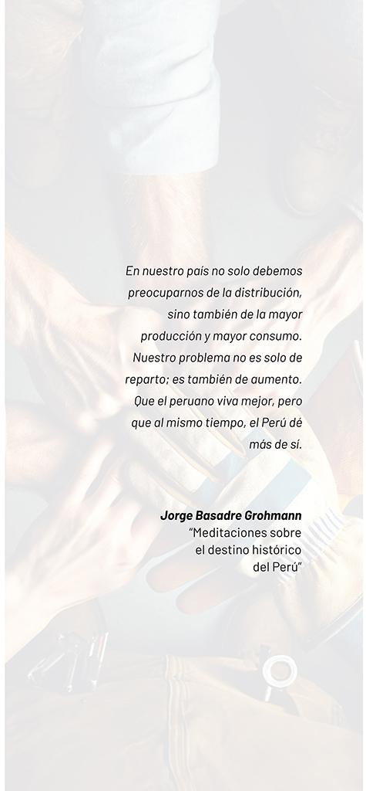
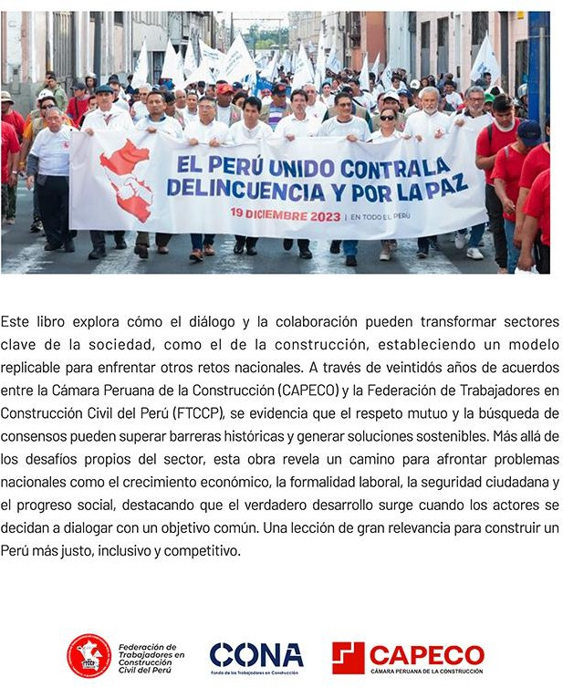

# CIERRE 

Este libro que ha pretendido resumir la experiencia de veintidós años de diálogo con resultados entre trabajadores y empresarios de la construcción, puede servir de inspiración a quienes todavía no encuentran motivos para buscar acuerdos pensando primero en el Perú.

Impreso en los talleres de Gráfica Fénix S.R.L. Lima - Perú

Año 2026

{width="4.947916666666667in" height="10.666666666666666in"}

{width="6.427083333333333in" height="7.854166666666667in"}