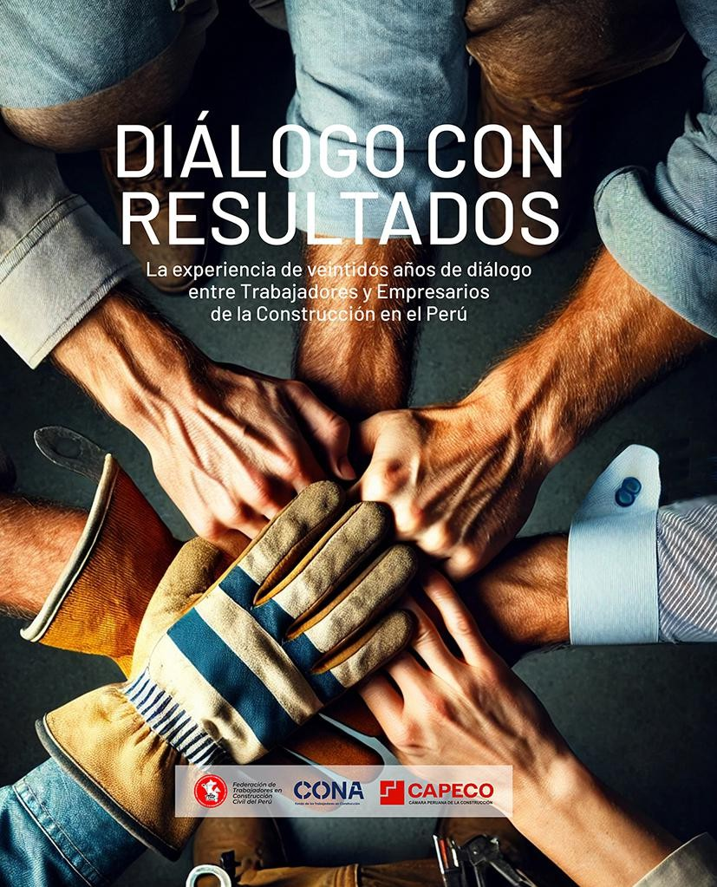
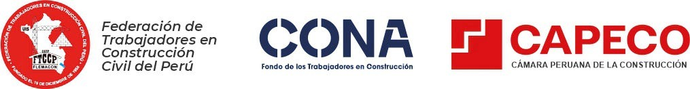

---
book:
  title: "Diálogo con resultados"
  author: "CONA"
lang: es-PE
---

{width="8.614583333333334in" height="10.65625in"}

{width="5.333333333333333in" height="10.666666666666666in"}

{width="8.267722003499562in" height="10.236221566054244in"}

# DIÁLOGO CON RESULTADOS

La experiencia de veintidós años de diálogo entre trabajadores y empresarios de la construcción en el Perú

DIÁLOGO CON RESULTADOS

La experiencia de veintidós años de diálogo entre trabajadores y empresarios de la construcción en el Perú

{width="3.277603893263342in" height="0.42625in"}

**Libro: Diálogo con Resultados. La experiencia de veintidós años de diálogo entre trabajadores y empresarios de la construcción en el Perú.**

**Editores:** Federación de Trabajadores en Construcción Civil del Perú (FTCCP), Fondo de los Trabajadores en Construcción (CONA) y la Cámara Peruana de la Construcción (CAPECO). 

**Editor general:** Guido Valdivia Rodríguez.

**Comité de edición:** Tito Zea Bendezú, Enrique Juscamaita Arangüena, Paca Villanueva Rojas, Óscar Churata Quispe, Enzo Brazzini Vega.

**Agradecimientos.** Los editores agradecemos a las personalidades que han comentado favorablemente, en diferentes medios de comunicación, los esfuerzos de diálogo que desarrollan la FTCCP, CAPECO y el CONA a lo largo de estos veintidós años y que han sido reproducidos en este libro: Alfonso Bustamante Canny, Fernando Carvallo Rey, Jaime de Althaus Guarderas, Max Hernández Camarero, Miguel Hidalgo Medina, Nicolás Lúcar de la Portilla, Carlos Neuhaus Tudela, Enrique Pajuelo Escobar, Javier Palacios Gallegos, Santiago Pedraglio Mendoza, Francisco Sagasti Hochhausler, Juan Sheput Moore, Carmela Sifuentes Inostroza, Ricardo Uceda Pérez, Antonio Zapata Velasco.

**Producción editorial y coordinación:** Jackie Cabanillas Mantilla \| construccionyvivienda.com

**Editor Gráfico:** Luis De los Rios Joya \| construccionyvivienda.com

**Número de edición:** Primera edición 2026

**Nombre de la editorial:** NEOMEDIA 360 S.A.C.

**Aviso legal:** Se autoriza la reproducción total o parcial de este libro, siempre que se indique la fuente y los créditos correspondientes.

A los trabajadores y empresarios de la construcción,

quienes, con su perseverancia, han demostrado que el entendimiento mutuo

construye un futuro mejor.